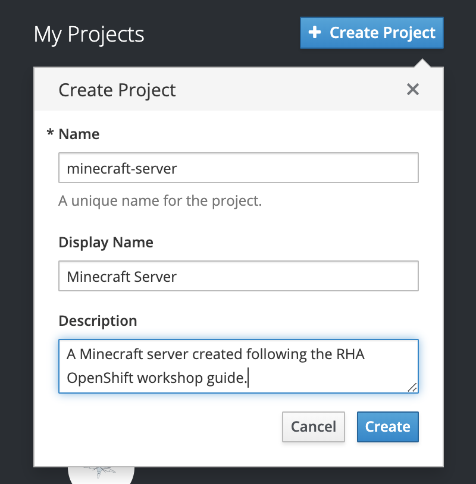
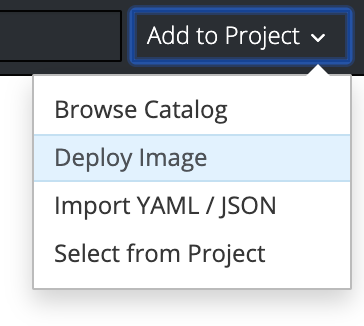
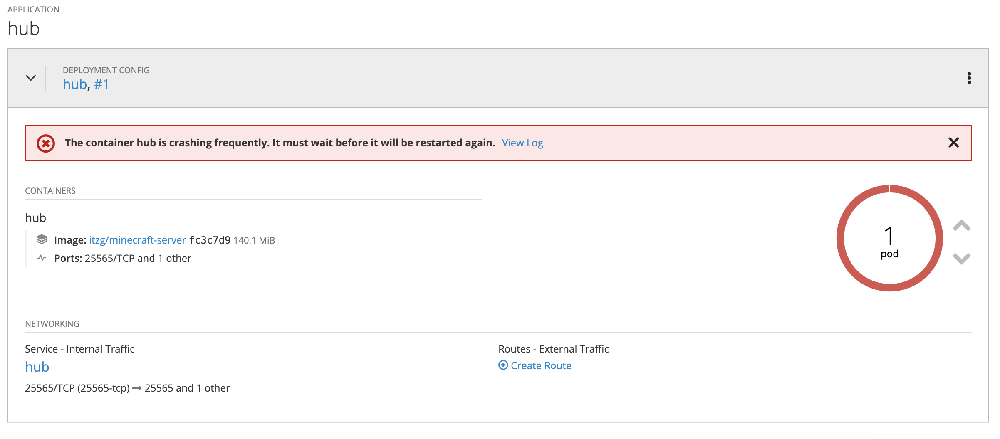
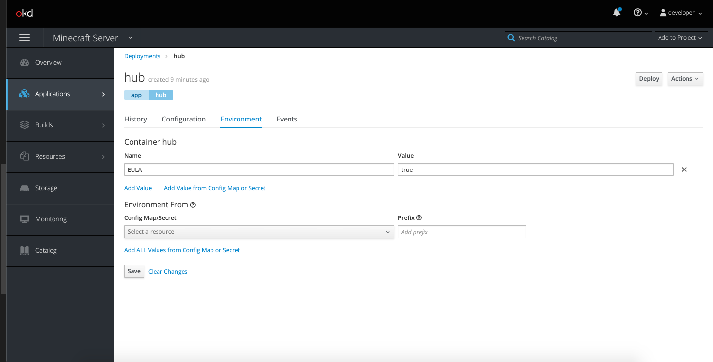

# Introduction
> Objective: Create a minecraft server app

One or more containers in an OpenShift cluster are configured in what is called a pod. Pods are distributed across cluster nodes which contain the resourses and services required to run the containers.

We're going to be using a publicly avalible image from the Docker Hub to deploy our minecraft server on openshift.

This guide will cover 2 ways to create new apps in OpenShift. The first is though the web console and the second is in the oc cli.
***
## Creating a project in the web console
Before doing anything you need to create a project for all of your apps to run in.

* Navigate to the web console.
* One the home page click create new project.
* Name the project `minecraft-server`
* You can also add a Display name and Description if you would like.



Now your ready to create your app.
***
## Creating an app in the Web Console
Click the project you just created to enter it
* Now click the Add to Project Dropdown on the top right and then Deploy Image



* Now click the Image Name radio as we will be using an image from the docker hub
* Type `itzg/minecraft-server` and click the magnifying glass
* Change the name of the application to hub
* Now click `Deploy`
***
## Diagnosing the Application
Now you've created the application!

Looks like there is an error though...



* Click `View Log` to see what the error is.
 ```
chmod: /data: Operation not permitted
Please accept the Minecraft EULA at
  https://account.mojang.com/documents/minecraft_eula 
by adding the following immediately after 'docker run':
  -e EULA=TRUE
 ```
 This error is because the minecraft server application requires you to set the EULA enviornment varriable to TRUE signifying that you accept the EULA.
* Navigate to *Application -> Deployments -> hub -> Enviornment*
* Now add a `EULA` enviornment varriable with a value of `true`
* Click `Save`



* Navigate to *Deployment -> Pods -> hub-X-XXXXX -> Logs*
* Now you will see your application deploying

By changing the enviornment varriable and clicking save you triggered a new deployment of the application.

You can also set the environment varriables in the a similar way when you create the application.

> See the [itzg/minecraft-server](https://hub.docker.com/r/itzg/minecraft-server/) docker hub page for more documentation on the avalible enviornment varriables for this image.

# Creating a new app in the Command Line
To access the command line for your cluster you must first add the oc binary to your `$PATH` so that you can use the `oc` command.

Luckily minishift provides and easy command for you to do this.

`minishift oc-env`

Use the command they provide to configure your shell.

* Now login to the cluster as developer using any password if prompted

  `oc login -u developer`

* Swtich to the minecraft-server project

  `oc project minecraft-server`

* Create and app called `smp` with the enviornment varriable `EULA` set to `true` from the image `itzg/minecraft-server`

  `oc new-app --name=smp -e EULA=true itzg/minecraft-server`

Now type `oc status` to view the deployment

You can use `oc get pods` to see what pods are running in your project

Then use `oc logs <pod name>` to view a pod's logs

## Changing Envionment Varriables in the CLI
Both of the applications we deployed are running using the stock minecraft-server.jar file. This is fine for now but later we want to proxy connections to these servers using bungeecord so we will need to use a different server binary.

By changing an enviornment varriable in both of the applications we can run a PaperSpigot server instead that has support for bungeecord.

Add an enviornment varriable called `TYPE` and set it's value to `PAPER` in both applications.

`oc set env dc/smp TYPE=PAPER`

`oc set env dc/hub TYPE=PAPER`

The `dc` is used to specify the resource type for each application that you are modifying. `dc` stands for **Deployment Config** which are the instructions for creating the application. We will cover deployment config more in [step 2](./step2PersistentVolumes.md).

Now the applications will start a new deployment with those new enviornment varriables.

# Afterward
Now you should have two apps running. These are both minecraft servers and are configured to run on PaperSpigot.

Add One more application called `bungee` using either the Web UI or CLI.

* Do not specify any enviornment varriables
* Use this image to create the app `itzg/bungeecord`

After this you should have 3 apps running in the `minecraft-server` project

If you need to for better performance, you can add these enviornemnt varriables to all of your applications to free up more ram.
```
INIT_MEMORY=512M
MAX_MEMORY=512M
```